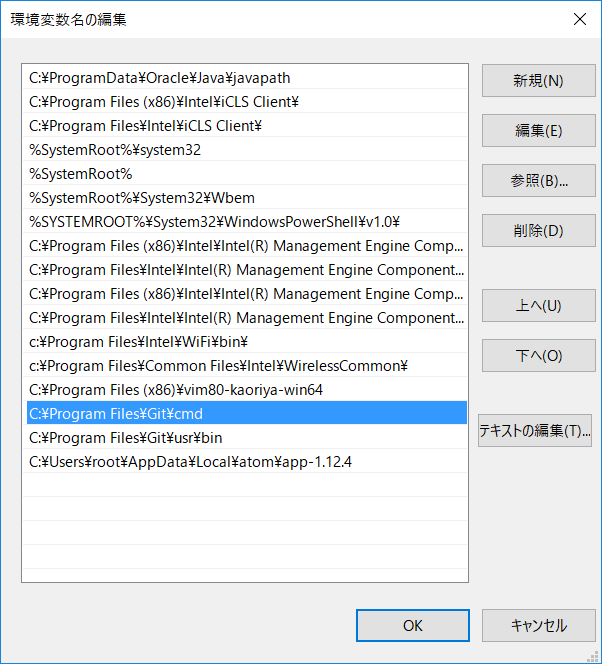

# development-enviroment-building
vagrant + vritualbox + cenos + apache + tomcat + gitbucket + jenkins + redmine + artifactory  の gavrant box を作る。

1. gitをインストールする。

 > https://git-scm.com/downloads/

1. git及びgit-bashのパスを通す。

 > ${Gitのインストールディレクトリ}\\cmd

 > ${Gitのインストールディレクトリ}\\usr\\bin

  

1. VirtualBoxをインストールする。

 > https://www.virtualbox.org/

1. Vagrantをインストールする。

 > https://www.vagrantup.com/downloads.html

1. a
